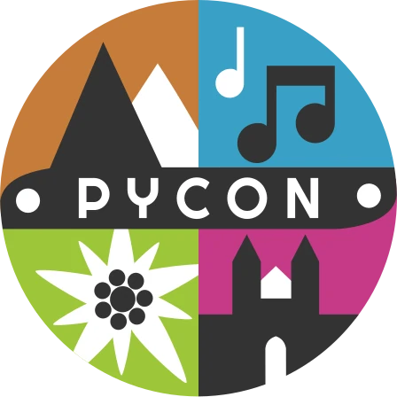

# Python User Group Graz

We are a group of people meeting on a regular basis in [Graz](https://osm.org/go/0Iz~DnN--?relation=34719) (Styria/Austria) to talk about the programming language [python](https://www.python.org).

We are open for everyone and are looking forward to meeting you!

## Next meeting

Usually we meet on the **first Tuesday of the month**. Topics and locations are announced here when available.

Most likely this will be:

:material-clock-time-seven-outline: March 3, 2026 
:material-clock-time-seven-outline: April 7, 2026

## Last meeting

:material-clock-time-seven-outline: February 3, 2026 - [Flet Coding Dojo](meetings/2026/2026-02-03.md)

## Stay connected

To keep informed about our events, you can follow us on [meetup.com/pygraz](https://www.meetup.com/pygraz/) or [events.graz.social/@pygraz](https://events.graz.social/@pygraz).

## Pycon Austria 2026

This year's [Pycon Austria](https://2026.pycon.at/) will be held in Eisenstadt from 19th to 20th of March 2026. The [call for papers](https://2026.pycon.at/blog/call-for-papers-open/) is open until the 6th of March 2026.

:material-clock-time-seven-outline: 19-20 March, 2026
:material-map-marker-outline: Eisenstadt, Austria
